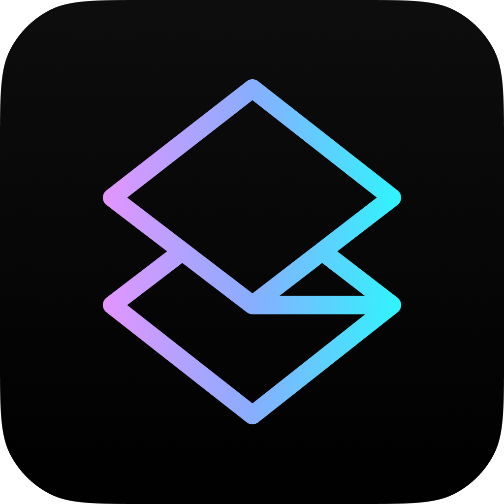
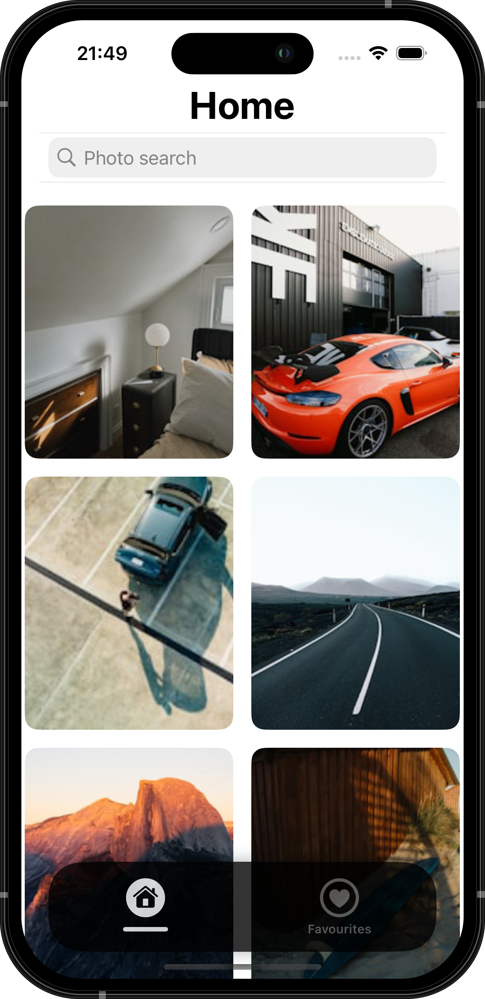
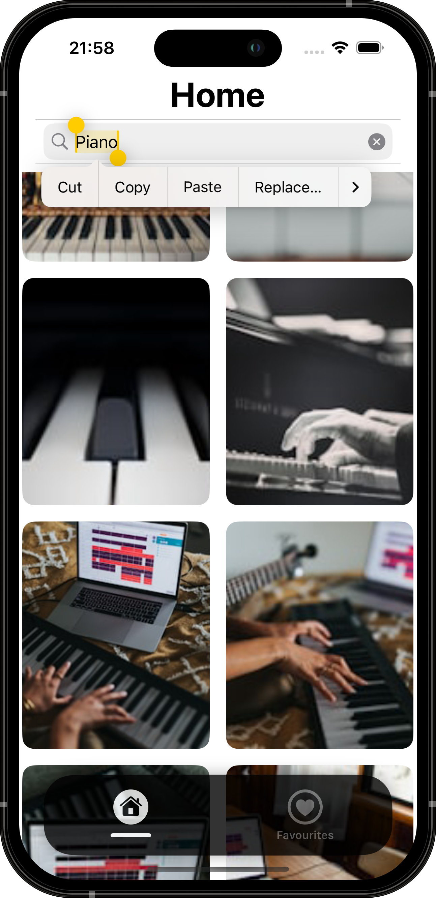
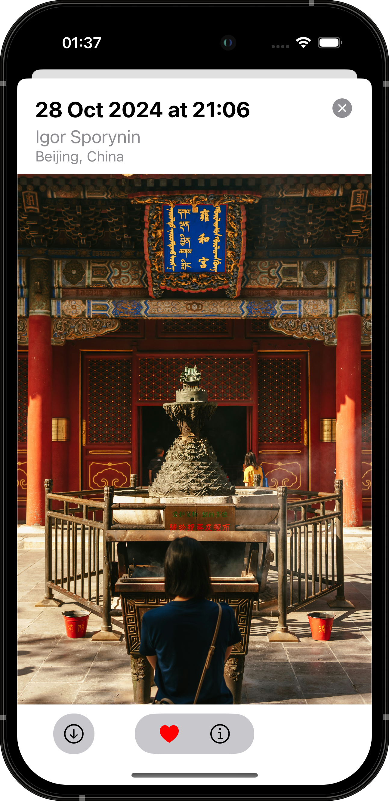
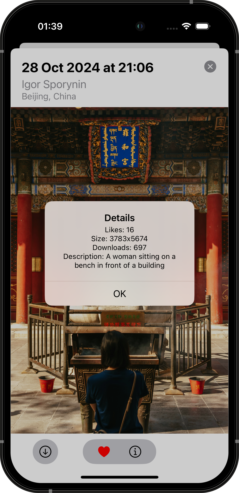
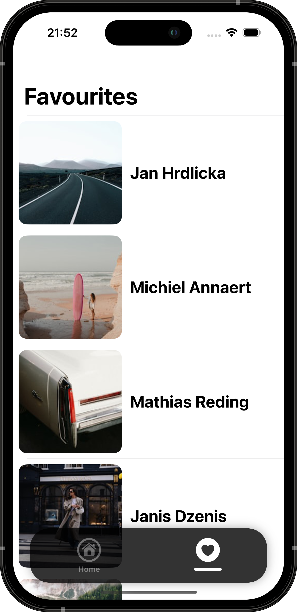
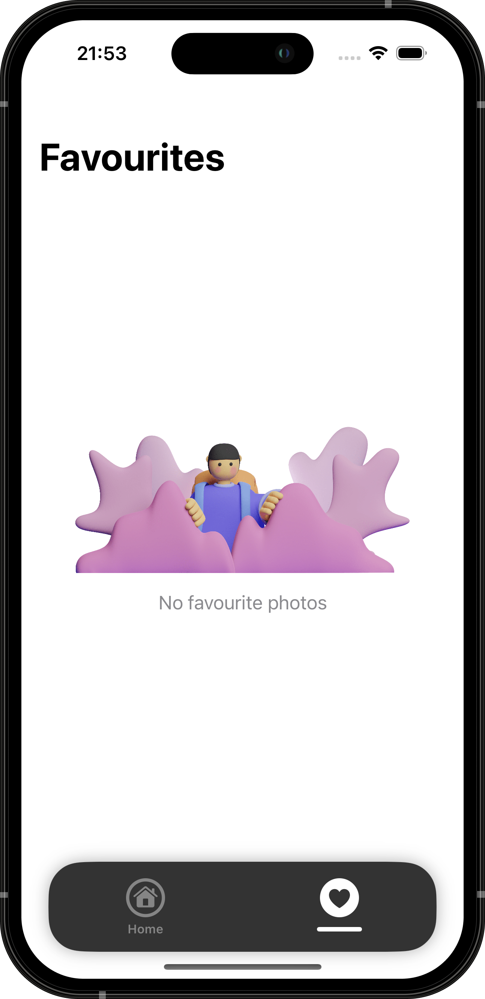
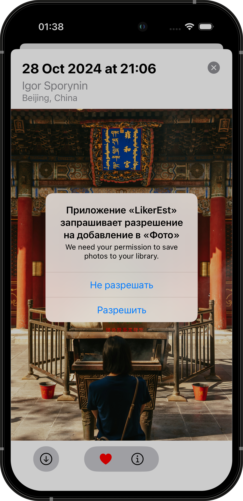

  
    
  
  
  
   
  
    

# LikerEst

LikerEst app gives you access to thousands of high-quality images from Unsplash, helps you save your favourite photos to your favourites and allows you to download them to your device.

The app also provides detailed information about each photo, such as author, creation date, location, and more.

## App Demo  

  <a href="https://youtu.be/NRNVkqIOuM4">
      
  </a>
  
  [YouTube link to App Demo](https://youtu.be/XWWipomukE4)

## Key Features  

- **Photo Search:** Intuitive keyword search tool.
- **Save to Favourites:** Easily add photos to your favourites for quick access.
- **Download Photos:** Allows you to download images to your device.
- **Details:** Information about the photo, including author, creation date, and location.
- **Offline Access:** Access your saved photos without the internet.

## Technologies Used in LikerEst  

1. Programming Language: [Swift](https://developer.apple.com/swift/) ([UIKit](https://developer.apple.com/documentation/uikit))
2. Data Storage: [CoreData](https://developer.apple.com/documentation/coredata)
3. RxSwift: For reactive programming and managing asynchronous operations
4. Layout: [Auto Layout](https://developer.apple.com/library/archive/documentation/UserExperience/Conceptual/AutolayoutPG/index.html)
5. Custom Tab Bar Dependencies:
   - [RxGesture](https://github.com/RxSwiftCommunity/RxGesture) for handling tapping on Tab Bar items
   - [RxSwift](https://github.com/ReactiveX/RxSwift) for informing the TabBarController that item has been tapped
6. [UIStackView](https://developer.apple.com/documentation/uikit/uistackview): For easy arrangement of interface elements
7. [Photos](https://apps.apple.com/us/app/photos/id1584215428): For working with the device photo gallery
8. [SDWebImage](https://github.com/SDWebImage/SDWebImage): A library for loading and caching images
9. Collection building with [UICollectionViewCompositionalLayout](https://developer.apple.com/documentation/uikit/uicollectionviewcompositionallayout)
10. Alamofire: A library for executing HTTP requests
11. Unsplash API: A source of photos for the app

## Screenshots  

[Figma Link](https://www.figma.com/design/slhc2dB8nQ1X5xrxAsH9ll/My-Water?m=auto&t=yZXKrerwixY9cKaX-6)

  
  
  
  
  
  
  

